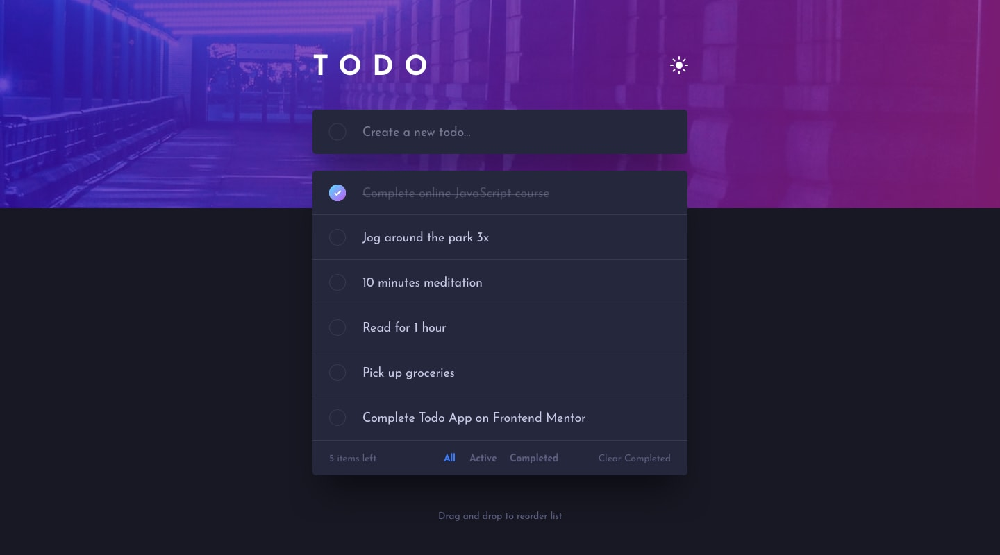

# Frontend Mentor - Results summary component solution

This is a solution to the [Todo app on Frontend Mentor](https://www.frontendmentor.io/challenges/todo-app-Su1_KokOW). Frontend Mentor challenges help you improve your coding skills by building realistic projects. 

## Table of contents

- [Overview](#overview)
  - [Screenshot](#screenshot)
  - [Links](#links)
- [My process](#my-process)
  - [Built with](#built-with)
- [Author](#author)


## Overview

### Screenshot




### Links

- Solution URL: [Repository](https://github.com/VandersonTavares/todoList)
- Live Site URL: [Todo Live](https://cheerful-kulfi-86f292.netlify.app)

## My process

### Built with

- Semantic HTML5 markup
- CSS custom properties
- Flexbox
- Mobile-first workflow
- [React](https://reactjs.org/) - JS library
- [Tailwind Css](https://tailwindcss.com) - For styles

```

## Author

- Website - [Vanderson Tavares](https://vandersontavares.netlify.app)
- Frontend Mentor - [@VandersonTavares](https://www.frontendmentor.io/profile/VandersonTavares)

